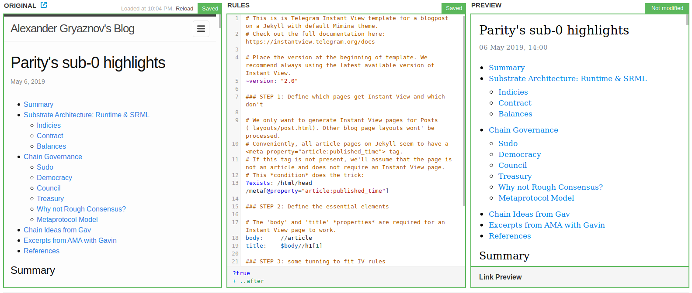

# Telegram Instant View template for Jekyll Mimina theme posts
Telegram Instant View Template for Jekyll Mimina blog

## How to use
1. Go to https://instantview.telegram.org/my/
2. Add your Jekyll mimina blog site
3. Add a page
4. Copy-paste the [Jekyll-minima-post.rules](Jekyll-minima-post.rules) content into the **Rules** input window
5. Make sure the **Preview** has been generated properly
6. Feel free to modify the rule is neccessary to customize your IV template
7. Click on *Track Changes* to save template

## More info
Check out the full Telegram IV documentation here: https://instantview.telegram.org/docs
